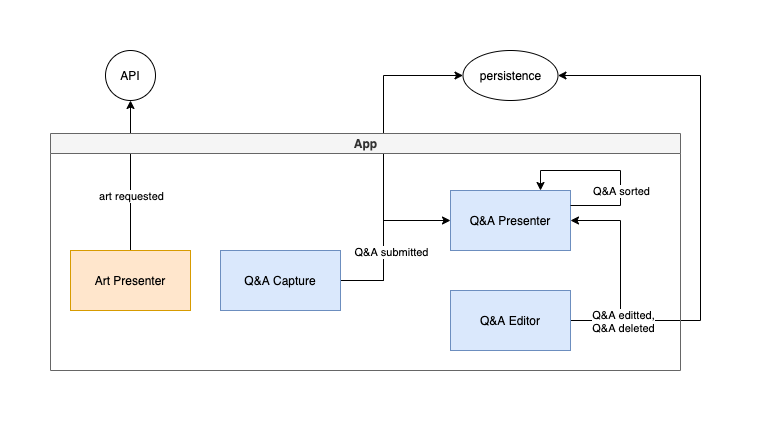

# Ask the Met

Visiting the Metropolitan Museum or Art in New York is not always feasible, even when there isn't a pandemic on. This shouldn't prevent us from appreciating and learning about the Met's collection though. With this simple app you can view a random piece or art, and create a list of questions and answers about it to review later.

## Architecture Description

An art-oriented "flashcard" style app.

### Users

Student or art history, expected to be handful per day.

### Requirements

- An example question and answer is shown by default
- Previously created questions and answers should be listed, and answer only revealed on click.
- Questions should be persisted
- Questions can be sorted for convenience
- Questions can be deleted
- Questions can be edited
- How to use the app should be communicated through tooltips
- Optional: tests

### Additional context

Tech stack must include react and redux. Optionally, depending on time, the supplementary stack will be tailwind (theming), react hook form (forms), ramda (utils), react routing (routing), firebase (db).

### Architecture characteristics

Architecture characterists are the "ilities" particular to an application that can or should influence to overall application architecture. In the case of "Ask the Met", one such characteristic could be **resilience**. If the internet goes down or is unavailable, as a ~~user~~ art-lover, I want my questions and answers to be saved. Accordingly, offline caching and asynchronous deferred data upload will be explored.

### Components

To discover the components (I'll call them modules to distiguish from UI components) of the application I tried an "event storming" approach where I assume events are used to communicate within and without the application (a.k.a typical of a standard redux app). Then module grouping the types of events were derived. For the ~~user~~ art-lover, the following core events are envisioned (subject to change):

- Art requested
- Q&A submitted
- Q&A editted
- Q&A deleted
- Q&A sorted

Based on these, an initial set of components might be:

- Art presenter component ("Art requested")
- Q&A capture component ("Q&A submitted")
- Q&A editor component (Q&A editted, "Q&A deleted")
- Q&A presenter component ("Q&A sorted")

## Stories

- [ ] As an art-lover I want to formulate a question and answer about a piece and save it.
- [ ] As an art-lover I want to get a new, random art piece and see basic information about it.
- [x] As an art-lover I only want to see the answers on click.
- [x] As an art-lover I want to be able to edit or delete questions and answers I previously submitted.
- [x] As an art-lover I want to organize my questions alphabetically.
- [x] As an art-lover I want to understand how to use the app (through tooltips).

## Improvements
- Extract common folder or component library, e.g. "primary-button"
